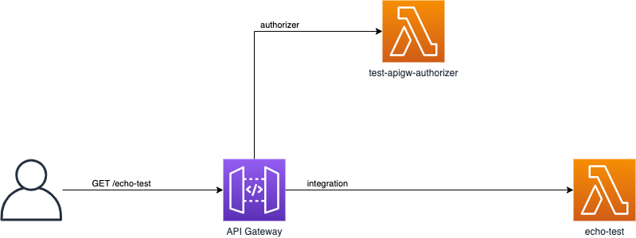
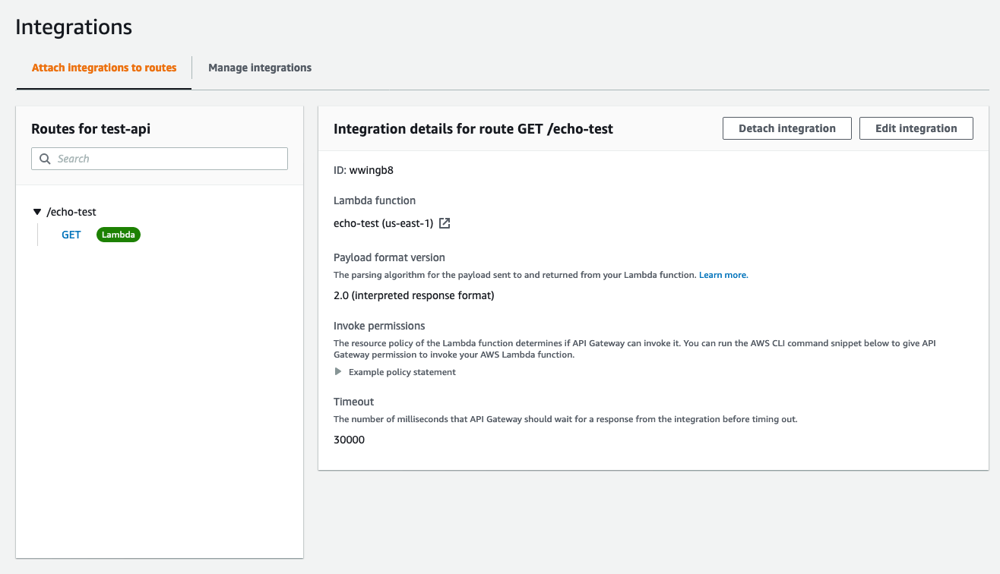
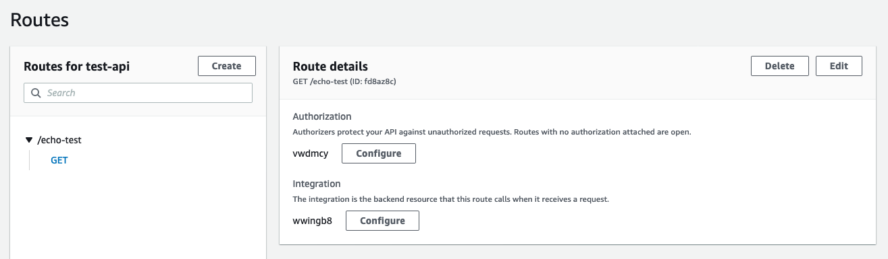
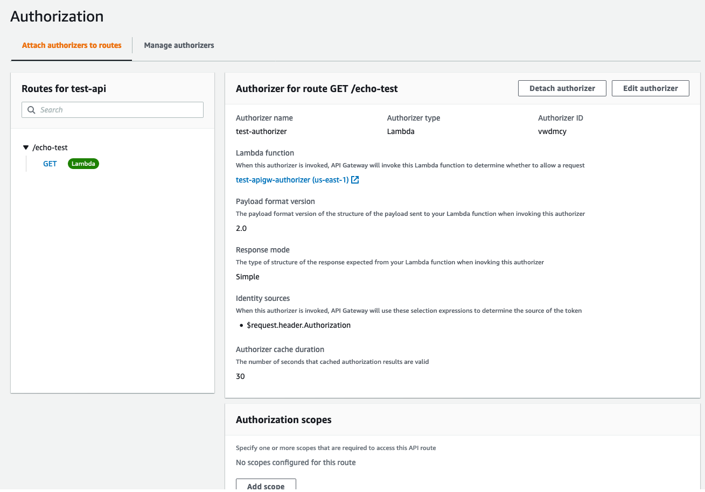

- [Introduction](#introduction)
- [Proof of Concept Design](#proof-of-concept-design)
- [Source Code](#source-code)
  - [The `echo-test` Lambda Function](#the-echo-test-lambda-function)
  - [The `test-apigw-authorizer` Lambda Function](#the-test-apigw-authorizer-lambda-function)
- [API Gateway Setup](#api-gateway-setup)
  - [Integration](#integration)
  - [Routes](#routes)
  - [Authorization](#authorization)
  - [Logging](#logging)
- [Testing](#testing)
  - [Command Line Testing](#command-line-testing)
  - [Examining the Logs](#examining-the-logs)
    - [The API Gateway Log Entry](#the-api-gateway-log-entry)
    - [Authorization Lambda Log Entry](#authorization-lambda-log-entry)
    - [Test Lambda BAckend Log Entry](#test-lambda-backend-log-entry)
- [Key Takeaways](#key-takeaways)

# Introduction

The idea is to test the basic functionality of an AWS API Gateway Lambda Authorizer.

# Proof of Concept Design



# Source Code

## The `echo-test` Lambda Function

This is just a script acting as a back-end for the API call. It returns a standard message.

Code:

```python
import json
import logging
import os

L = logging.getLogger()
L.setLevel(logging.INFO)
if int(os.getenv('DEBUG', '0')) > 0:
    L.setLevel(logging.DEBUG)

def lambda_handler(event, context):
    L.info('event={}'.format(event))
    return {
        'statusCode': 200,
        'body': json.dumps('Hello from Lambda!')
    }

```

## The `test-apigw-authorizer` Lambda Function

This is the Lambda Authorizer that we will be linking to from the API Gateway

Code:

```python
import json
import os
import logging

L = logging.getLogger()
L.setLevel(logging.INFO)
if int(os.getenv('DEBUG', '0')) > 0:
    L.setLevel(logging.DEBUG)

def lambda_handler(event, context):
    L.info('event={}'.format(event))
    return {
      "isAuthorized": True,
      "context": {
        "exampleKey": "exampleValue"
      }
    }

```

Keep in mind that the set-up assumes a version 2.0 for the incoming and response messages. 

The response follows a `Simple Response` message format.

References:

* [Working with AWS Lambda authorizers for HTTP APIs](https://docs.aws.amazon.com/apigateway/latest/developerguide/http-api-lambda-authorizer.html)

# API Gateway Setup

Using the AWS Web Console, a simple API Gateway (HTTP gateway) was provisioned. Below are some screenshots of relevant settings:

## Integration



Note that this assumes a version 2 payload as well.

## Routes



Only the `GET` method is supported

A simple route of `/echo-test` which links the authorizer and the integration to this route and method.

## Authorization



## Logging

For the proof of concept, logging was enabled with the following JSON formatted message template:

```json
{
    "requestId":"$context.requestId", 
    "ip": "$context.identity.sourceIp", 
    "requestTime":"$context.requestTime", 
    "httpMethod":"$context.httpMethod",
    "routeKey":"$context.routeKey", 
    "status":"$context.status",
    "protocol":"$context.protocol", 
    "responseLength":"$context.responseLength", 
    "authzLatency": "$context.authorizer.latency", 
    "integrationLatency": "$context.integration.latency", 
    "integrationRequestId": "$context.integration.requestId" 
}
```

References:

* [Customizing HTTP API access logs](https://docs.aws.amazon.com/apigateway/latest/developerguide/http-api-logging-variables.html)

# Testing

## Command Line Testing

A simple `curl` test:

```bash
$ curl -vvv -X GET -H "Authorization: "Authorization: iJIUzI1NiJ9.eyJpc3MiOiJzdGF0dW0ubGlmZSIsInN1YiI6ImM5NzY2NWI1OWU2ZDFlNTY3YjNhMThkZDEzYjZjM2ZkYjdmYWU4MmEwOTQzYjc3N2Y0YjFhYmZjZGE1MTFhM2M5ZjA2OWQ5ZWRhMWY2NjRlZjU0ZDcxM2M4OWU3MjAwMWYxNjYzNjFlY2M5NjUwNWQxOWZlNjBkNTI4ZGMyMDUxIiwiYXVkIjoiYXBpLnN0YXR1bS5saWZlIiwiZXhwIjoxNTk5NzE1Mjg1LCJuYmYiOjE1OTk3MTQ5ODUsImlhdCI6MTU5OTcxNDk4NSwianRpIjoiMjk4MmMxM2E0NGFkNDA3OGVkYjI3MGY2NzBmOGQ0YTAyZDIwOWJjNzdiNzg2ZWU5NzhiYTI3YTY0YWJlYTQ1ZmI2NGNiYWQzZTcwYzFiMjBiYmFiZTMyZDdmMmUwNGM1YTg0ZjFmM2U5YWZhZWIxNzk4NzgzNDBiMWIwY2ZjMWYifQ.Z0w0ef9HgdUYv_7H1QC2cE5jECVwhUi33o0qLEZw91I""  https://66j88og9x3.execute-api.us-east-1.amazonaws.com/dev/echo-test
Note: Unnecessary use of -X or --request, GET is already inferred.
* Could not resolve host: iJIUzI1NiJ9.eyJpc3MiOiJzdGF0dW0ubGlmZSIsInN1YiI6ImM5NzY2NWI1OWU2ZDFlNTY3YjNhMThkZDEzYjZjM2ZkYjdmYWU4MmEwOTQzYjc3N2Y0YjFhYmZjZGE1MTFhM2M5ZjA2OWQ5ZWRhMWY2NjRlZjU0ZDcxM2M4OWU3MjAwMWYxNjYzNjFlY2M5NjUwNWQxOWZlNjBkNTI4ZGMyMDUxIiwiYXVkIjo
* Closing connection 0
curl: (6) Could not resolve host: iJIUzI1NiJ9.eyJpc3MiOiJzdGF0dW0ubGlmZSIsInN1YiI6ImM5NzY2NWI1OWU2ZDFlNTY3YjNhMThkZDEzYjZjM2ZkYjdmYWU4MmEwOTQzYjc3N2Y0YjFhYmZjZGE1MTFhM2M5ZjA2OWQ5ZWRhMWY2NjRlZjU0ZDcxM2M4OWU3MjAwMWYxNjYzNjFlY2M5NjUwNWQxOWZlNjBkNTI4ZGMyMDUxIiwiYXVkIjo
Note: Unnecessary use of -X or --request, GET is already inferred.
*   Trying 3.211.156.0...
* TCP_NODELAY set
* Connected to 66j88og9x3.execute-api.us-east-1.amazonaws.com (3.211.156.0) port 443 (#1)
* ALPN, offering h2
* ALPN, offering http/1.1
* successfully set certificate verify locations:
*   CAfile: /etc/ssl/cert.pem
  CApath: none
* TLSv1.2 (OUT), TLS handshake, Client hello (1):
* TLSv1.2 (IN), TLS handshake, Server hello (2):
* TLSv1.2 (IN), TLS handshake, Certificate (11):
* TLSv1.2 (IN), TLS handshake, Server key exchange (12):
* TLSv1.2 (IN), TLS handshake, Server finished (14):
* TLSv1.2 (OUT), TLS handshake, Client key exchange (16):
* TLSv1.2 (OUT), TLS change cipher, Change cipher spec (1):
* TLSv1.2 (OUT), TLS handshake, Finished (20):
* TLSv1.2 (IN), TLS change cipher, Change cipher spec (1):
* TLSv1.2 (IN), TLS handshake, Finished (20):
* SSL connection using TLSv1.2 / ECDHE-RSA-AES128-GCM-SHA256
* ALPN, server accepted to use h2
* Server certificate:
*  subject: CN=*.execute-api.us-east-1.amazonaws.com
*  start date: Nov 20 00:00:00 2019 GMT
*  expire date: Dec 20 12:00:00 2020 GMT
*  subjectAltName: host "66j88og9x3.execute-api.us-east-1.amazonaws.com" matched cert's "*.execute-api.us-east-1.amazonaws.com"
*  issuer: C=US; O=Amazon; OU=Server CA 1B; CN=Amazon
*  SSL certificate verify ok.
* Using HTTP2, server supports multi-use
* Connection state changed (HTTP/2 confirmed)
* Copying HTTP/2 data in stream buffer to connection buffer after upgrade: len=0
* Using Stream ID: 1 (easy handle 0x7ff40680d600)
> GET /dev/echo-test HTTP/2
> Host: 66j88og9x3.execute-api.us-east-1.amazonaws.com
> User-Agent: curl/7.64.1
> Accept: */*
> Authorization: Authorization:
>
* Connection state changed (MAX_CONCURRENT_STREAMS == 128)!
< HTTP/2 200
< date: Thu, 10 Sep 2020 08:42:44 GMT
< content-type: text/plain; charset=utf-8
< content-length: 20
< apigw-requestid: SpEIxi9MoAMEMXw=
<
* Connection #1 to host 66j88og9x3.execute-api.us-east-1.amazonaws.com left intact
"Hello from Lambda!"* Closing connection 1
```

Note: In the example the default JWT from `https://jwt.io` is used and the payload is as follow:

```json
{
  "sub": "1234567890",
  "name": "John Doe",
  "iat": 1516239022
}
```

This is just out of interest and has no real bearing on this specific proof of concept.

## Examining the Logs

The various AWS CloudWatch log entries reflecting the test above can be seen in this section

### The API Gateway Log Entry

```json
{
    "requestId": "SpEIxi9MoAMEMXw=",
    "ip": "165.73.110.75",
    "requestTime": "10/Sep/2020:08:42:44 +0000",
    "httpMethod": "GET",
    "routeKey": "GET /echo-test",
    "status": "200",
    "protocol": "HTTP/1.1",
    "responseLength": "20",
    "authzLatency": "-",
    "integrationLatency": "25",
    "integrationRequestId": "5aa80e1f-25fb-4d7b-b142-33474c527a74"
}
```

### Authorization Lambda Log Entry

```text
START RequestId: 46a079f9-ab6c-436b-badf-fb0f4e595ec2 Version: $LATEST
[INFO]	2020-09-10T08:42:44.836Z	46a079f9-ab6c-436b-badf-fb0f4e595ec2	event={'version': '2.0', 'type': 'REQUEST', 'routeArn': 'arn:aws:execute-api:us-east-1:342872205792:66j88og9x3/dev/GET', 'identitySource': ['Authorization:'], 'routeKey': 'GET /echo-test', 'rawPath': '/dev/echo-test', 'rawQueryString': '', 'headers': {'accept': '*/*', 'authorization': 'Authorization:', 'content-length': '0', 'host': '66j88og9x3.execute-api.us-east-1.amazonaws.com', 'user-agent': 'curl/7.64.1', 'x-amzn-trace-id': 'Root=1-5f59e704-ef643d104323e541d43af53f', 'x-forwarded-for': '165.73.110.75', 'x-forwarded-port': '443', 'x-forwarded-proto': 'https'}, 'requestContext': {'accountId': '342872205792', 'apiId': '66j88og9x3', 'domainName': '66j88og9x3.execute-api.us-east-1.amazonaws.com', 'domainPrefix': '66j88og9x3', 'http': {'method': 'GET', 'path': '/dev/echo-test', 'protocol': 'HTTP/1.1', 'sourceIp': '165.73.110.75', 'userAgent': 'curl/7.64.1'}, 'requestId': 'SpEIxi9MoAMEMXw=', 'routeKey': 'GET /echo-test', 'stage': 'dev', 'time': '10/Sep/2020:08:42:44 +0000', 'timeEpoch': 1599727364812}}
END RequestId: 46a079f9-ab6c-436b-badf-fb0f4e595ec2
REPORT RequestId: 46a079f9-ab6c-436b-badf-fb0f4e595ec2	Duration: 1.25 ms	Billed Duration: 100 ms	Memory Size: 128 MB	Max Memory Used: 52 MB	
```

The event payload, in a prettier format:

```python
{
    'version': '2.0', 
    'type': 'REQUEST', 
    'routeArn': 'arn:aws:execute-api:us-east-1:342872205792:66j88og9x3/dev/GET', 
    'identitySource': ['Authorization:'], 
    'routeKey': 'GET /echo-test', 
    'rawPath': '/dev/echo-test', 
    'rawQueryString': '', 
    'headers': {
        'accept': '*/*', 
        'authorization': 'Authorization:', 
        'content-length': '0', 
        'host': '66j88og9x3.execute-api.us-east-1.amazonaws.com', 
        'user-agent': 'curl/7.64.1', 
        'x-amzn-trace-id': 'Root=1-5f59e704-ef643d104323e541d43af53f', 
        'x-forwarded-for': '165.73.110.75', 
        'x-forwarded-port': '443', 
        'x-forwarded-proto': 'https'
    }, 
    'requestContext': {
        'accountId': '342872205792', 
        'apiId': '66j88og9x3', 
        'domainName': '66j88og9x3.execute-api.us-east-1.amazonaws.com', 
        'domainPrefix': '66j88og9x3', 
        'http': {
            'method': 'GET', 
            'path': '/dev/echo-test', 
            'protocol': 'HTTP/1.1', 
            'sourceIp': '165.73.110.75', 
            'userAgent': 'curl/7.64.1'
        }, 
        'requestId': 'SpEIxi9MoAMEMXw=', 
        'routeKey': 'GET /echo-test', 
        'stage': 'dev', 
        'time': '10/Sep/2020:08:42:44 +0000', 
        'timeEpoch': 1599727364812
    }
}
```

### Test Lambda BAckend Log Entry

```text
START RequestId: 5aa80e1f-25fb-4d7b-b142-33474c527a74 Version: $LATEST
[INFO]	2020-09-10T08:42:44.869Z	5aa80e1f-25fb-4d7b-b142-33474c527a74	event={'version': '2.0', 'routeKey': 'GET /echo-test', 'rawPath': '/dev/echo-test', 'rawQueryString': '', 'headers': {'accept': '*/*', 'authorization': 'Authorization:', 'content-length': '0', 'host': '66j88og9x3.execute-api.us-east-1.amazonaws.com', 'user-agent': 'curl/7.64.1', 'x-amzn-trace-id': 'Root=1-5f59e704-ef643d104323e541d43af53f', 'x-forwarded-for': '165.73.110.75', 'x-forwarded-port': '443', 'x-forwarded-proto': 'https'}, 'requestContext': {'accountId': '342872205792', 'apiId': '66j88og9x3', 'authorizer': {'lambda': {'exampleKey': 'exampleValue'}}, 'domainName': '66j88og9x3.execute-api.us-east-1.amazonaws.com', 'domainPrefix': '66j88og9x3', 'http': {'method': 'GET', 'path': '/dev/echo-test', 'protocol': 'HTTP/1.1', 'sourceIp': '165.73.110.75', 'userAgent': 'curl/7.64.1'}, 'requestId': 'SpEIxi9MoAMEMXw=', 'routeKey': 'GET /echo-test', 'stage': 'dev', 'time': '10/Sep/2020:08:42:44 +0000', 'timeEpoch': 1599727364812}, 'isBase64Encoded': False}
END RequestId: 5aa80e1f-25fb-4d7b-b142-33474c527a74
REPORT RequestId: 5aa80e1f-25fb-4d7b-b142-33474c527a74	Duration: 1.23 ms	Billed Duration: 100 ms	Memory Size: 128 MB	Max Memory Used: 52 MB	
```

The event payload, in a prettier format:

```python
{
    'version': '2.0', 
    'routeKey': 'GET /echo-test', 
    'rawPath': '/dev/echo-test', 
    'rawQueryString': '', 
    'headers': {
        'accept': '*/*', 
        'authorization': 'Authorization:', 
        'content-length': '0', 
        'host': '66j88og9x3.execute-api.us-east-1.amazonaws.com', 
        'user-agent': 'curl/7.64.1', 
        'x-amzn-trace-id': 'Root=1-5f59e704-ef643d104323e541d43af53f', 
        'x-forwarded-for': '165.73.110.75', 
        'x-forwarded-port': '443', 
        'x-forwarded-proto': 'https'
    }, 
    'requestContext': {
        'accountId': '342872205792', 
        'apiId': '66j88og9x3', 
        'authorizer': {
            'lambda': {
                'exampleKey': 'exampleValue'
            }
        }, 
        'domainName': '66j88og9x3.execute-api.us-east-1.amazonaws.com', 
        'domainPrefix': '66j88og9x3', 
        'http': {
            'method': 'GET', 
            'path': '/dev/echo-test', 
            'protocol': 'HTTP/1.1', 
            'sourceIp': '165.73.110.75', 
            'userAgent': 'curl/7.64.1'
        }, 
        'requestId': 'SpEIxi9MoAMEMXw=', 
        'routeKey': 'GET /echo-test', 
        'stage': 'dev', 
        'time': '10/Sep/2020:08:42:44 +0000', 
        'timeEpoch': 1599727364812
    }, 
    'isBase64Encoded': False
}
```

# Key Takeaways

It was nice to see that the authorization token payload is not presented in the log files. This will lower the change of someone with access to the log files impersonating another user, especially for long lived JWT tokens.


